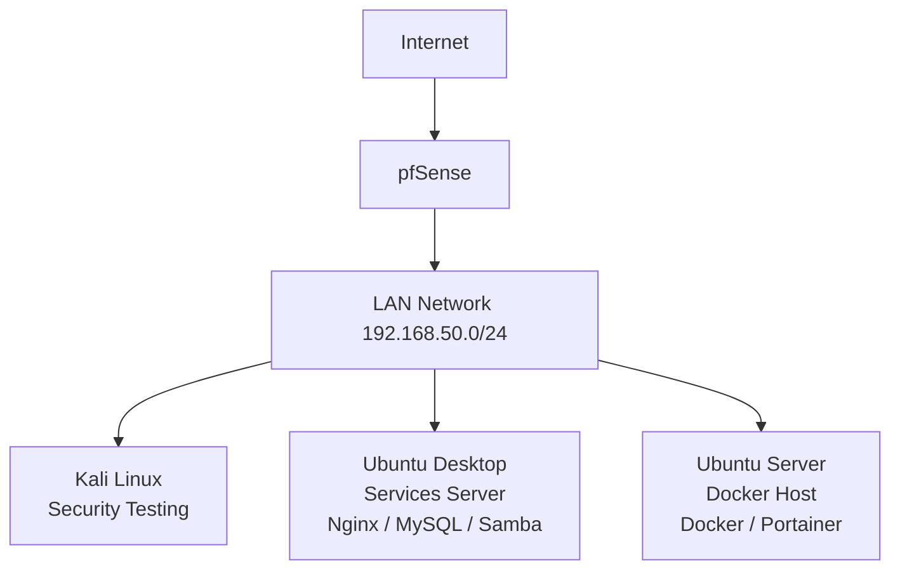

# Simple Homelab

## Overview

This repository documents a small and simple homelab built for learning and experimentation.

The main goal of this lab is to practice working with a firewall and virtualization environment using **pfSense** and **VMware Workstation Pro**.

The environment also provides a place to learn the basics of **Linux servers, networking, containerization, and security testing tools** in a controlled lab setup.

---

## Goals of the Lab

This homelab was created to practice and learn:

* Firewall configuration and network management using **pfSense**
* Virtual machine management with **VMware Workstation Pro**
* Linux server administration on **Ubuntu**
* Network scanning and host discovery using **Nmap**
* Traffic analysis using **Wireshark**
* Basic security testing using **Kali Linux**
* Containerization using **Docker**

---

## Lab Architecture

The lab is intentionally simple and contains several virtual machines connected to a single LAN network.

### Virtual Machines

| Machine            | Role                                  |
| ------------------ | ------------------------------------- |
| **pfSense**        | Firewall and network gateway          |
| **Ubuntu Desktop** | Service server (Nginx, MySQL, Samba)  |
| **Ubuntu Server**  | Container host (Docker and Portainer) |
| **Kali Linux**     | Security testing and network analysis |

All machines are connected to the same **LAN network**, with **pfSense** acting as the firewall between the internal lab network and the internet.

---

## Lab Features

The homelab currently includes the following technologies and services:

### Network Infrastructure

* **pfSense firewall configuration**
* **VMware virtual networking**
* Internal lab network: `192.168.50.0/24`

### Linux Services

Ubuntu Desktop is used to host traditional Linux services:

* **Nginx** – web server
* **MySQL** – database server
* **Samba** – file sharing service

### Container Environment

Ubuntu Server is used as a container host:

* **Docker Engine**
* **Portainer** container management
* Docker containers (example: **Nginx container**)

### Security and Network Testing

* **Nmap** for network scanning and host discovery
* **Wireshark** for network traffic analysis
* **Kali Linux** for security testing tools

## Purpose

This project is intended purely for **learning and educational purposes**.

The lab environment allows safe experimentation with:

* firewall configuration
* network troubleshooting
* Linux server administration
* container environments
* basic security testing tools

This repository also serves as documentation of the lab setup and the learning process.

## Lab Topology

The diagram below shows the simplified network topology used in this homelab.

